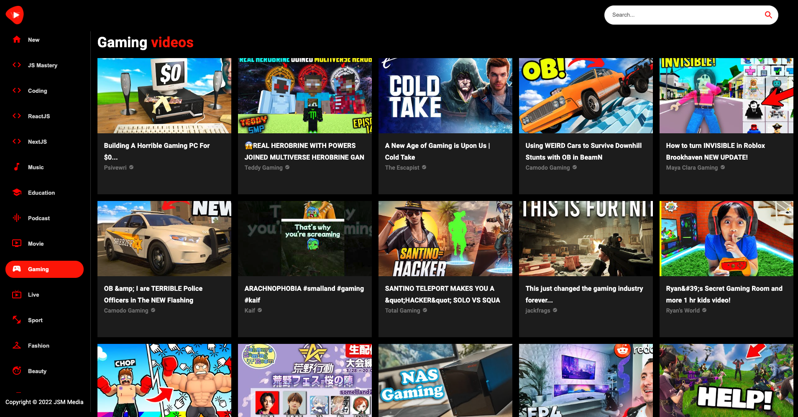
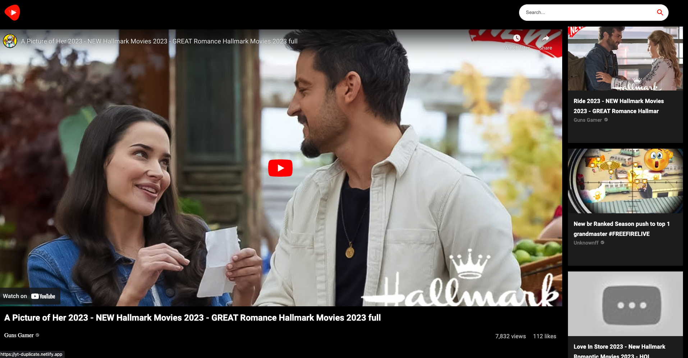

# YouTube Dublicate

## Developed with following:

* React
* Rapid API
* Material UI
* Axios
* CSS
## Link to App- [YT Dublicate](https://yt-duplicate.netlify.app/)

## Description

### I'm thrilled to share with you a React YouTube clone app that I built with the help of JS Mastery's tutorial. With the power of React, Material UI, Rapid API, and Tailwind CSS. I created an app that emulates the familiar and enjoyable experience of watching videos on YouTube.
---
## Knowledge Gained & Credits

### Throughout this project, I gained valuable experience accessing and manipulating the YouTube API to fetch video data, display thumbnails of videos, and playing videos. The app also features recommended videos that provide users with a similar video-watching experience as YouTube.

### I'm particularly grateful to JS Mastery for providing an insightful and easy-to-follow tutorial that guided me through the development process. The guidance I received has been instrumental in making this project possible, and I highly recommend it to anyone looking to learn how to build a YouTube clone with these tools.

### Overall, I'm proud of what I've accomplished with this React YouTube clone and excited to share it with others. I'm looking forward to continuing to build my skills and exploring the possibilities offered by React and these other powerful technologies. I look forward to the future possibilities for development and innovation in this field.
----
### Link to Tutorial
* https://www.youtube.com/watch?v=FHTbsZEJspU